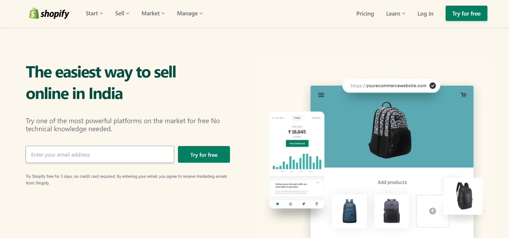

# [Project 18](https://jagadeeshproject18.netlify.app/)

 

# [Shopify Website Home Page Clone](https://jagadeeshproject18.netlify.app/)

  

- Replicated the website Home page as close as possible

  

>**Learnings from the project**

- Responsiveness-mobile responsiveness as well in tailwind css
- How to work with transitions & animations is tailwind css
- Always design for mobile's first. Then it will be easy to work.

  

  &nbsp; 

 
